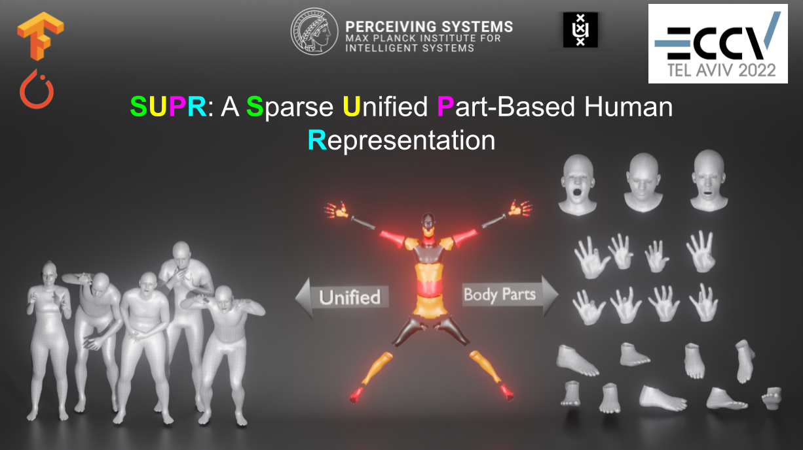
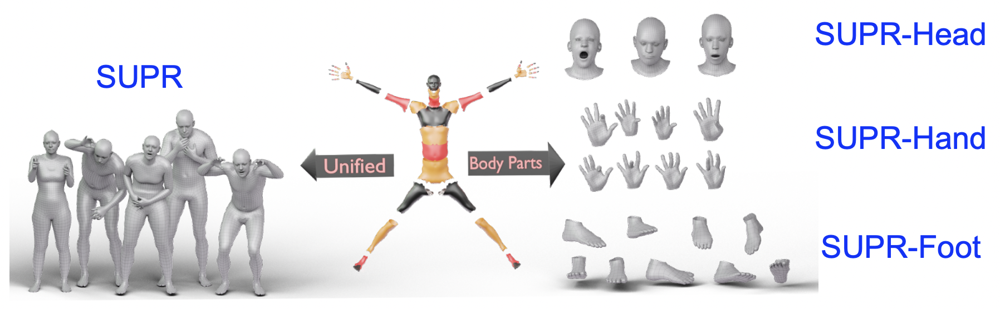
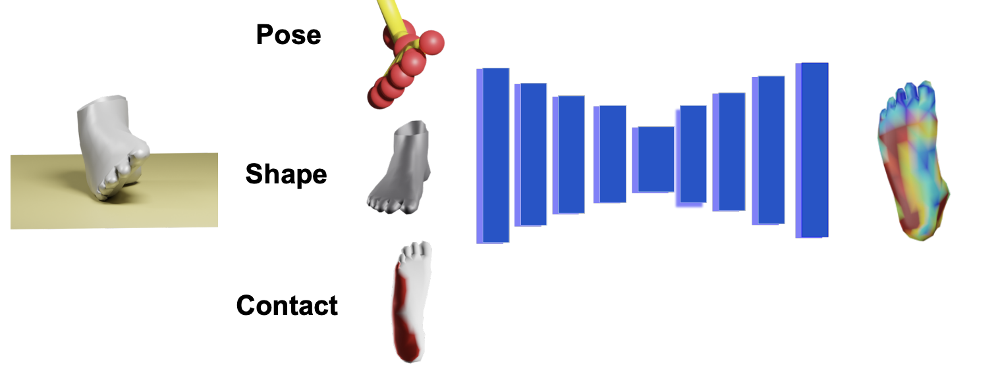
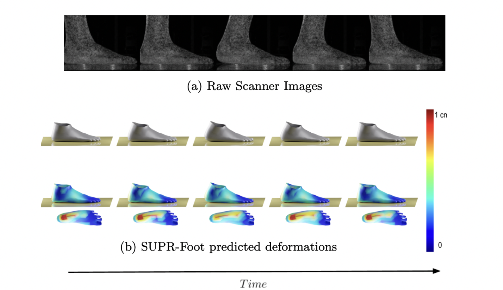
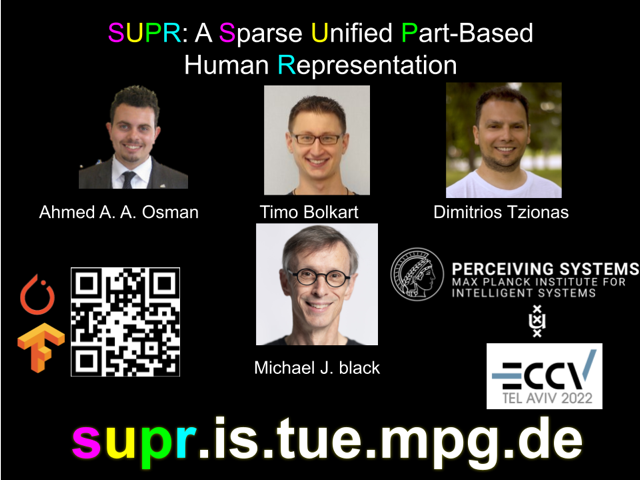

# SUPR: A Sparse Unified Part-Based Human Representation (ECCV 2022)


> **_TLDR:_**  We release a full suite of state of the art models ( 18 models ): A body model, hand model, head model and a foot model, trained on a federated dataset of 1.2 million body, head, hand and foot registrations. 

This repository contains the official Tensorflow and PyTorch implementation of ECCV 2022:

SUPR: A Sparse Unified Part-Based Human Representation

Ahmed A. A. Osman, Timo Bolkart, Dimitrios Tzionas, and Michael J. Black 


[[Paper Page](https://supr.is.tue.mpg.de)] [[Paper](https://ps.is.mpg.de/uploads_file/attachment/attachment/699/0570_source.pdf)] [[Supp. Mat.](https://ps.is.mpg.de/uploads_file/attachment/attachment/700/0570-supp.pdf)] 




## Table of Contents
  * [License](#license)
  * [Key Ideas](#key-ideas)
  * [Installation](#installation)
  * [Citation](#citation)
  * [Acknowledgments](#acknowledgments)
  * [Contact](#contact)

## License

Software Copyright License for non-commercial scientific research purposes.
Please read carefully the [LICENSE file](https://github.com/ahmedosman/SUPR/blob/master/LICENSE) and any accompanying
documentation before you download and/or use the SUPR model and software, (the "Data & Software"). By downloading and/or using the Data & Software (including downloading, cloning, installing, and any other use of the corresponding github repository), you acknowledge that you have read these [terms and conditions](https://github.com/ahmedosman/SUPR/blob/master/LICENSE) in the LICENSE file, understand them, and agree to be bound by them. If you do not agree with these [terms and conditions](https://github.com/ahmedosman/SUPR/blob/master/LICENSE), you must not download and/or use the Data & Software. Any infringement of the terms of this agreement will automatically terminate your rights under this [License](https://github.com/ahmedosman/SUPR/blob/master/LICENSE)


## Key Ideas
Existing body parts models for the head and hands fail to capture the head and hands full range of motion and deformations because they are trained on body part scans which do not capture the head/hand full range of motion. Our key insight is body part scans capture detailed deformations of the head/hand while full body scans capture the full range of motion of the individual body parts releative to the body. To this end, we train SUPR, an expressive body model on a federated dataset of body,hand, head and foot scans, then separate the model into a full suite of state art of the art body part models ( SUPR-Head head model, SUPR-Hand hand model and SUPR-Foot foot model). 



When separating the models, we suprisingly observe that the body part models for the head/hands are influenced by more joints compared to the artists designed kinematic tree commonly used in head/hand models. 


SUPR is an expressive body model based on the SMPL-X template mesh, with significantly more joints to model the human foot and toes full range of motion. 


In order to model the foot deformations due to scene contact, we propose an architecture conditioned on the foot pose, shape and scene contact descriptor to predict the foot deformations due to ground contact. 






## Installation
 This repo contains the Tensorflow and PyTorch model loaders for SUPR and the separated body part models.

 We recommend doing the following in a python3 virtual environment.

1. Clone the repository: 

```Shell
git clone git@github.com:ahmedosman/SUPR.git
```

2. Install your favourite Auto Diff. framework 
PyTorch
```
pip install pytorch==1.6
```

Tensorflow
```
pip install tensorflow-gpu==2.3
```


3. Install with pip
```
pip install .
``` 

4. Download the models. 

5. Check the hello world scripts under demo/ in this repo.  

## Downloading the model

All models and data are publicly avaiable for research purposes on our website, [SUPR](https://supr.is.tue.mpg.de). Please register, and accept our license. The models are avaiable under the Downloads tab of the website. 




## Citation

If you find the paper useful for your work,  please consider citing SUPR: 

```
@inproceedings{SUPR:2022,
      author = {Osman, Ahmed A A and Bolkart, Timo and Tzionas, Dimitrios and Black, Michael J.},
      title = {{SUPR}: A Sparse Unified Part-Based Human Body Model},
      booktitle = {European Conference on Computer Vision (ECCV)},
      year = {2022},
      url = {https://supr.is.tue.mpg.de}
}   
```


and our earlier related works: 

```
@inproceedings{SMPL-X:2019,
    title = {Expressive Body Capture: 3D Hands, Face, and Body from a Single Image},
    author = {Pavlakos, Georgios and Choutas, Vasileios and Ghorbani, Nima and Bolkart, Timo and Osman, Ahmed A. A. and Tzionas, Dimitrios and Black, Michael J.},
    booktitle = {Proceedings IEEE Conf. on Computer Vision and Pattern Recognition (CVPR)},
    year = {2019}
}
```

```
@inproceedings{STAR:2020,
      author = {Osman, Ahmed A A and Bolkart, Timo and Black, Michael J.},
      title = {{STAR}: A Sparse Trained Articulated Human Body Regressor},
      booktitle = {European Conference on Computer Vision (ECCV)},
      pages = {598--613},
      year = {2020},
      url = {https://star.is.tue.mpg.de}
}    
```

## Acknowledgments

The authors thank the MPI-IS Tu ̈bingen members of the data capture team since 2012 for capturing the data used to train SUPR: S. Polikovsky, A. Keller, E. Holderness, J. M ́arquez, T. Alexiadis, M. H ̈oschle, M. Landry, G. Henz, M. Safroshkin, M. Landry, T. McConnell, T. Bauch and B. Pellkofer for the IT support. The authors thank M. Safroshkin and M. Landry for configuring the foot scanner. The authors thank the International Max Planck Research School for Intelligent Systems (IMPRS-IS) for supporting Ahmed A. A. Osman.


## Contact
The code of this repository was implemented by [Ahmed A. A. Osman](https://ps.is.mpg.de/person/aosman).

For questions, please contact [supr@tue.mpg.de](supr@tue.mpg.de).

For commercial licensing (and all related questions for business applications), please contact [ps-licensing@tue.mpg.de](ps-licensing@tue.mpg.de).
